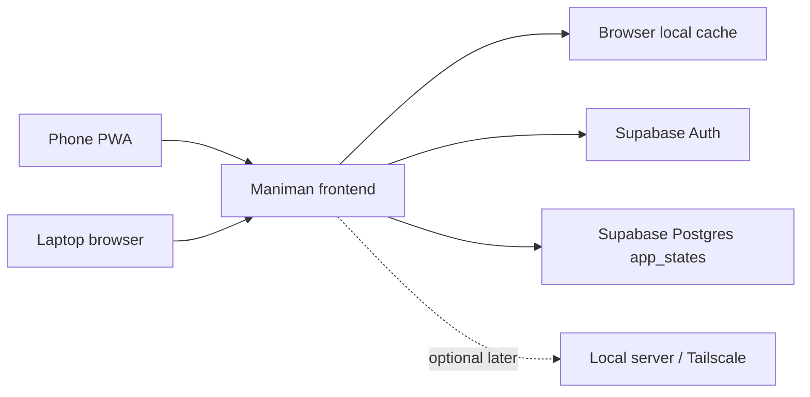

# Maniman Interim Mobile-First Cloud Plan

Generated: 2026-06-03

## Summary

Maniman is currently a local-first money manager that can run as a static browser app or through the tiny local Node server. Because there is no spare always-on device available for the next couple of months, the interim deployment should use a cautious cloud-backed mode that works reliably from the phone and laptop.

The chosen interim approach is:

- Mobile-first installable PWA.
- Cloudflare Pages for static hosting.
- Supabase Auth for login.
- Supabase Postgres for one JSON state document per user.
- Existing browser-local and local-server modes preserved for future local hosting.

Expected personal-use cost in India is Rs 0/month on free tiers, excluding an optional custom domain.

## Why This Is Needed

The current local-server setup works well when a laptop or home device is online, but there is no spare device to keep running right now. Phone-first use also matters because transactions are usually recorded at the moment they happen. A hosted PWA gives the phone a stable always-available entry point while keeping the future local-server path open.

## Architecture



## Storage Modes

Maniman should support three storage modes:

| Mode | Source of truth | Use case |
|---|---|---|
| Browser-only | Browser localStorage | Offline/single-device fallback |
| Local server | `data/maniman-state.json` via `/api/state` | Future spare-device/Tailscale setup |
| Cloud | Supabase `app_states.state` JSONB | Interim phone+laptop sync |

The frontend should continue saving a local cache after each successful state change so data is still visible if the cloud is temporarily unavailable.

## Supabase Data Model

Use a single-row-per-user JSON document for the first cloud phase.

```sql
create table if not exists public.app_states (
  user_id uuid primary key references auth.users(id) on delete cascade,
  state jsonb not null,
  revision bigint not null default 0,
  updated_at timestamptz not null default now()
);

alter table public.app_states enable row level security;

create policy "Users can read their own app state"
on public.app_states for select
using (auth.uid() = user_id);

create policy "Users can insert their own app state"
on public.app_states for insert
with check (auth.uid() = user_id);

create policy "Users can update their own app state"
on public.app_states for update
using (auth.uid() = user_id)
with check (auth.uid() = user_id);
```

## Security Assumptions

- Supabase anon key is safe to ship in the frontend when Row Level Security is enabled.
- Service-role keys must never be placed in frontend files.
- Email/password login is enough for the first cloud phase.
- Full end-to-end encryption is deferred because it complicates reports, recovery, sync, and automation.
- No financial transaction values/descriptions should be sent to monitoring or AI providers in this phase.

## Cost Assumptions For India

| Item | Expected cost |
|---|---:|
| Cloudflare Pages free hosting | Rs 0/month |
| Supabase Free Auth/Postgres | Rs 0/month for personal use |
| Custom domain | Optional, roughly Rs 750-Rs 1,200/year |
| Local server device | Deferred |

## Implementation Checklist

1. Rename Pocket Pilot to Maniman.
2. Add PWA metadata, service worker, and installable app shell.
3. Make mobile the primary navigation and transaction-entry experience.
4. Add Supabase config placeholder and auth UI.
5. Add cloud storage adapter with revision-aware saves.
6. Keep browser-local and local-server modes.
7. Add sync status labels and fallback behavior.
8. Verify phone and laptop sync with the same Supabase account.

## Later Migration Options

When a spare device is available:

- Keep cloud mode as the primary source of truth if it works well.
- Export cloud JSON and import it into the local server.
- Run the local server through Tailscale for private access.
- Keep cloud mode only as a backup/sync option.
